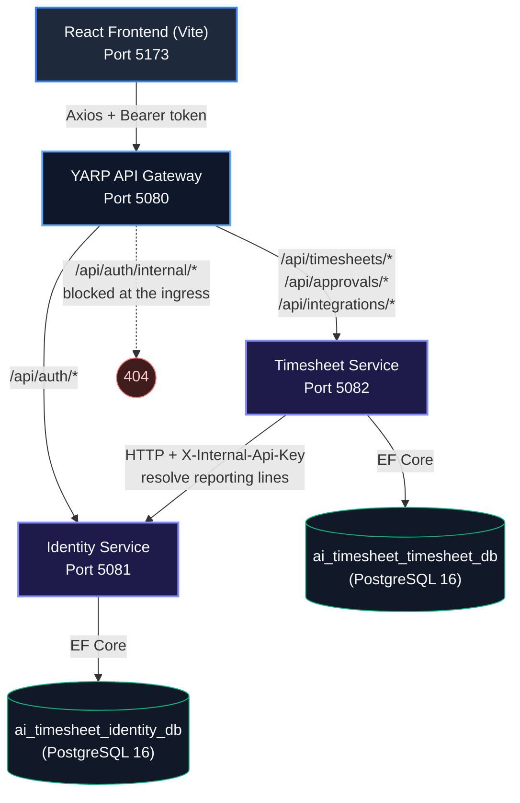

# AI Timesheet Generator

An AI-powered timesheet generator built as a **microservices architecture** with a
**repository/service layering**, **JWT authentication with claims-based authorization**,
and a React front end.

```
Employee signs in (password, then an authenticator code if 2FA is on) -> Gateway routes ->
Identity Service issues a 15-minute access token + a rotating refresh cookie ->
Timesheet Service validates the JWT and derives the user from its claims -> pulls tool activity ->
AI (or the deterministic fallback) drafts the week -> employee edits and submits ->
their manager approves -> stored in isolated PostgreSQL databases.
```

---

## 🏗️ High-level architecture



### Ports

| Component | URL |
|---|---|
| React frontend | `http://localhost:5173` |
| YARP API gateway | `http://localhost:5080` — **all** API traffic goes here |
| Identity service | `http://localhost:5081` |
| Timesheet service | `http://localhost:5082` |
| PostgreSQL | `localhost:5432` |

---

## 🔒 Security model

**Identity always comes from the JWT.** Every endpoint derives the acting user from the
`NameIdentifier` claim. No route parameter or request body carries a user id, so one
employee cannot read, edit, submit or approve another's timesheet by changing an id.

| Rule | Where it is enforced |
|---|---|
| Password verified with PBKDF2-HMAC-SHA256 (210k iterations, per-user salt) | `PasswordHasher` |
| Unknown email = failed login, never a new account | `AuthService.LoginAsync` |
| Role comes from the stored row, never from the email address | `AuthService.LoginAsync` |
| Employees can only touch their own data | `ApiControllerBase.CurrentUserId` + per-action ownership checks |
| Approvals are manager-only **and** limited to direct reports | `[Authorize(Roles = ...)]` + reporting-line check in `ApprovalController.Decide` |
| Only a `Submitted` sheet can be decided; only an unsubmitted one can be edited | `TimesheetController`, `ApprovalController` |
| `/api/auth/internal/*` never reachable from a browser | blocked in `Gateway/Program.cs` **and** gated by `X-Internal-Api-Key` |
| Provider OAuth tokens encrypted at rest | `TokenProtector` (ASP.NET Data Protection) |
| Login is rate limited, per client address | `[EnableRateLimiting("login")]`, 10/minute |
| Optional TOTP second factor (RFC 6238) | `TotpService`, verified against the RFC's own test vectors |
| TOTP secrets encrypted at rest; codes cannot be replayed | `SecretProtector`, `User.TotpLastUsedStep` |
| Access tokens last 15 minutes; refresh tokens rotate on every use | `RefreshTokenService` |
| A replayed refresh token kills every session in its family | `RefreshTokenService.RotateAsync` |
| Refresh token is httpOnly — unreadable by page JavaScript | `ait_rt` cookie, `SameSite=Strict`, `Path=/api/auth` |

**No secrets are committed.** The JWT signing key, database passwords and the internal API
key come from `dotnet user-secrets` locally and from environment variables
(`Jwt__Key`, `ConnectionStrings__DefaultConnection`, `Internal__ApiKey`) elsewhere. Both
services refuse to start if they are missing.


### Two-factor authentication

Opt-in, per user, from the **Security** screen. Enrolment is deliberately two-phase:
`POST /api/auth/totp/setup` stores a secret but leaves 2FA **off**, and only
`POST /api/auth/totp/enable` — which requires a live code — turns it on. Someone who closes
the tab halfway through is not locked out.

- **Algorithm**: TOTP over HMAC-SHA1, 6 digits, 30-second step — what Google Authenticator,
  Microsoft Authenticator, Authy and 1Password all default to. Implemented directly on
  `System.Security.Cryptography` and unit-tested against the RFC 6238 Appendix B vectors.
- **Clock drift**: one step either side is accepted.
- **Replay**: the last accepted time step is recorded per user, so a code that is still
  inside its 30-second window cannot be used twice.
- **Recovery**: ten single-use codes are issued when 2FA is turned on, shown exactly once,
  and stored only as hashes. A recovery code is accepted anywhere an authenticator code is.
- **Secret storage**: encrypted with ASP.NET Data Protection. In a multi-instance
  deployment the key ring must be shared, or enrolments break on failover.

Login becomes two calls when 2FA is on:

```
POST /api/auth/login       { email, password }
-> 200 { requiresTotp: true, mfaToken }      // no access token yet

POST /api/auth/login/totp  { mfaToken, code }
-> 200 { user, accessToken, expiresAtUtc }   // + Set-Cookie: ait_rt=...
```

The `mfaToken` is a five-minute JWT issued for a **different audience**
(`AITimesheet.Client.Mfa`), so a half-finished login can never be presented to a resource
endpoint as a real credential — and an access token cannot be replayed at the TOTP step.

### Sessions and refresh tokens

| | Access token | Refresh token |
|---|---|---|
| Lifetime | 15 minutes | 14 days, restarted on each rotation |
| Stored | in memory in the SPA | httpOnly cookie, `SameSite=Strict`, `Path=/api/auth` |
| Readable by JS | yes (but short-lived) | **no** |
| In the database | no | SHA-256 hash only |

Every call to `POST /api/auth/refresh` rotates: the presented token is revoked and a new one
issued in the same *family*. Presenting an already-rotated token is the signature of a stolen
cookie, so it revokes the **entire family** — the attacker and the real user are both signed
out, rather than both holding live credentials.

The SPA keeps the access token in a module variable, never in storage. A page reload restores
the session through the refresh cookie, and a 401 on any call triggers one silent refresh and
a replay of the original request (concurrent 401s share a single refresh).

### Demo accounts

Seeded by migration, with a real reporting line so the approval flow works immediately.

| Name | Email | Password | Role |
|---|---|---|---|
| Priya Sharma | `priya@company.com` | `Demo@123` | Employee (reports to Sarah) |
| Sarah Jenkins | `sarah@company.com` | `Demo@123` | Manager |

Neither has 2FA enabled, so the demo is walkable straight away. Turn it on from **Security**
to exercise the two-step flow.

> These are demo credentials in a public repository. Change them before this is exposed to
> anything real: `dotnet user-secrets` for the keys, and a new `HasData` hash for the users.

---

## 🚀 Setup

### Prerequisites

- [.NET 8 SDK](https://dotnet.microsoft.com/download)
- [Node.js 18+](https://nodejs.org)
- PostgreSQL 15+ (or Docker)

### 1. Database

```bash
cp .env.example .env          # then edit POSTGRES_PASSWORD
docker compose up -d
```

This starts PostgreSQL and creates `ai_timesheet_identity_db` and
`ai_timesheet_timesheet_db`. Each service applies its own EF Core migrations on boot,
including the demo user seed.

> `database/schema.sql` is **reference documentation**, not a setup script — running it
> first will leave you with tables EF Core cannot migrate over.

### 2. Local secrets

```bash
./scripts/set-dev-secrets.sh          # Windows: ./scripts/set-dev-secrets.ps1
```

Generates a JWT key and an internal API key, and writes both — plus the connection
strings — into user-secrets for the two services. Run it once after cloning.

### 3. Backend

```bash
# Terminal 1
dotnet run --project backend/AITimesheet.IdentityService

# Terminal 2
dotnet run --project backend/AITimesheet.TimesheetService

# Terminal 3
dotnet run --project backend/AITimesheet.Gateway
```

Each service exposes `/health`, and Swagger is available in development at
`http://localhost:5081/swagger` and `http://localhost:5082/swagger`.

### 4. Frontend

```bash
cd frontend
npm install
cp .env.example .env
npm run dev
```

Open `http://localhost:5173` and sign in as Priya or Sarah.

### 5. Tests

```bash
dotnet test backend/AITimesheet.Tests
```

101 tests covering the password hasher (including a guard that the seeded migration hashes
still match the documented demo password), TOTP against the RFC 6238 vectors, base32 against
the RFC 4648 vectors, refresh token rotation and reuse detection, the week-boundary
calculation, activity deduplication, the deterministic timesheet generator, and the claims
helpers.

---

## 🤖 The AI engine

`OpenAiTimesheetService` calls Azure OpenAI when it is configured and otherwise uses a
deterministic rule-based generator, so the app is fully usable with no API key. To enable
the model:

```bash
dotnet user-secrets --project backend/AITimesheet.TimesheetService \
  set "AzureOpenAI:Endpoint" "https://<resource>.openai.azure.com"
dotnet user-secrets --project backend/AITimesheet.TimesheetService \
  set "AzureOpenAI:ApiKey" "<key>"
```

Model output is validated and clamped before it is persisted; anything unparseable falls
back to the deterministic generator rather than producing an empty timesheet.

## 🔌 Integrations

GitHub, Azure DevOps, Jira and Microsoft Graph calendar. A provider whose fetch fails
records the reason against the connection and contributes nothing — the Connect Accounts
screen shows the error instead of silently substituting sample data. A user who has
connected nothing gets one clearly-labelled sample week so the flow can still be walked
through end to end.

## 🎨 Tech stack

- **Frontend**: React 18, TypeScript (strict), Vite, Axios, Chart.js, qrcode
- **Gateway**: YARP with active health checks
- **Services**: ASP.NET Core 8, repository + unit-of-work, DI, RFC 7807 problem details, rate limiting, health checks
- **Auth**: JWT access tokens, rotating refresh tokens with reuse detection, PBKDF2 passwords, TOTP 2FA
- **Database**: PostgreSQL 16 via EF Core & Npgsql
- **AI**: Azure OpenAI GPT-4o with a deterministic fallback
- **Tests**: xUnit
